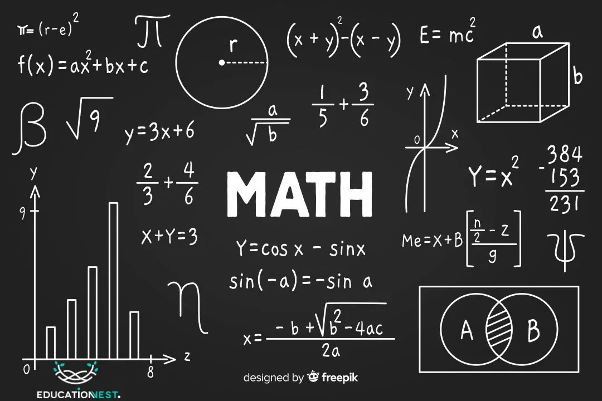

# Math for AI — Part 2: Statistics, How a Model Knows It's Wrong

**🚧 This part is being written.** Part 1 (Linear Algebra) is live — this is the next stop on the track.

## Where we're headed

In Part 1 you learned how a model *computes* — vectors, dot products, and `W·x + b`. Part 2 is about how a model *learns*: it needs a way to measure how wrong it is, and a way to reason about uncertainty. That's **statistics**.

The plan for this part:

- **Mean, variance, and "spread"** — the difference between an average and what the average hides, and why every dataset gets *normalized* before training.
- **Probability you'll actually use** — distributions, expectation, and reading the percentages a classifier spits out without overtrusting them.
- **Loss functions are just statistics** — how "you're off, try again" becomes a single number the model can shrink. We'll connect it straight back to the linear algebra from Part 1.
- **The bridge to code** — every idea paired with a short NumPy snippet, same as Part 1.

## Status

In drafting — check back here, or watch the Tutorials page. New parts appear as soon as they're written and tested. ☕
