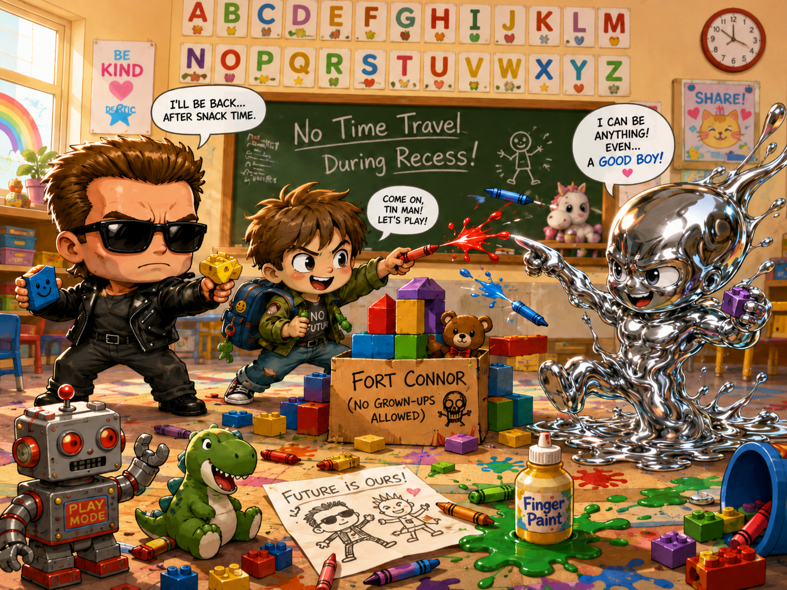
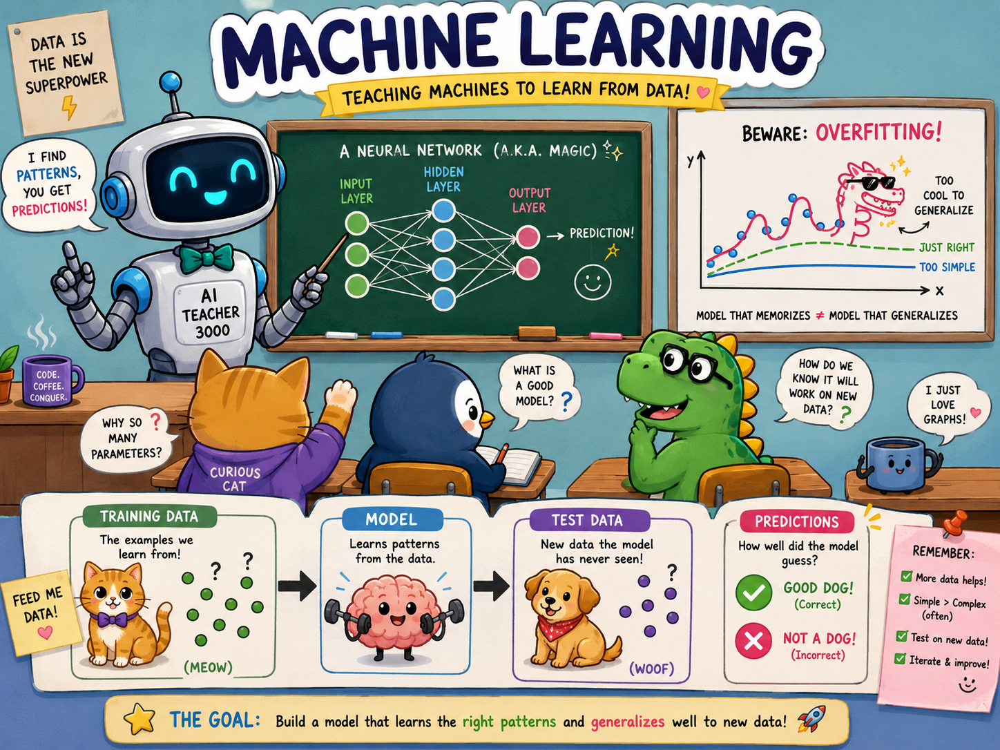

# Math for AI — Part 1: Linear Algebra, The Language Your Model Speaks

Here's a secret the textbooks bury under 200 pages of proofs: **a neural network is basically a stack of multiplications and additions wearing a fancy coat.** That's it. The "math" everyone's scared of is mostly *linear algebra* — and linear algebra is just a tidy way of doing a lot of multiplying and adding at once, without losing your mind.

In this part we'll build the whole vocabulary — scalars, vectors, matrices, the dot product — using examples you can picture. Then I'll show you where each one *actually shows up* inside real machine learning, so it stops feeling like homework and starts feeling like a cheat code. 🔑

By the end you'll read the line `output = W·x + b` and think *"oh, that's just a neuron"* instead of panicking.



## The whole cast of characters (in 30 seconds)

Linear algebra has exactly four kinds of "thing." You already understand three of them.

| Name | What it is | Everyday example |
| --- | --- | --- |
| **Scalar** | A single number | Your age: `27` |
| **Vector** | A list of numbers | A pizza order: `[2, 0, 1]` (2 cheese, 0 pepperoni, 1 veggie) |
| **Matrix** | A grid of numbers | A spreadsheet, or a grayscale photo |
| **Tensor** | A grid with *more* dimensions | A color photo (height × width × 3 colors) |

That's the entire alphabet. Everything else is just *operations* on these four. Let's meet them properly.

**📷 Picture idea:** four little icons side by side — a single dot (scalar), a row of dots (vector), a grid (matrix), a stack of grids (tensor). Drop the file in as `cast.png` and reference it here.

## Vectors: a list of numbers with an attitude

A **vector** is just an ordered list of numbers:

```
v = [3, 4]
```

But here's the fun part — a vector is *also* an arrow. The vector `[3, 4]` means "walk 3 steps right, then 4 steps up." Every list of numbers is secretly a direction-and-distance.

**📷 Picture idea:** a grid with an arrow starting at the origin going to the point (3, 4), labeled `v = [3, 4]`. This one image makes vectors "click" for most people. Save it as `vector-arrow.png`.

### You can do two things to a vector

**1. Add two vectors** — line them up and add slot by slot:

```
[3, 4] + [1, 2] = [4, 6]
```

Picture it as "do the first walk, then the second walk, where do you end up?" If you're building a game and your character has a movement vector and you add a wind vector — congratulations, you just used linear algebra. 🎮

**2. Scale a vector** — multiply every number by one scalar:

```
2 × [3, 4] = [6, 8]
```

The arrow points the same way but is twice as long. "Double the recipe" is scalar multiplication.

In NumPy, both are one line:

```python
import numpy as np

v = np.array([3, 4])
w = np.array([1, 2])

print(v + w)    # [4 6]   -> add
print(2 * v)    # [6 8]   -> scale
```

That's not "code that does math." In NumPy, the math *is* the code. You'll feel that more and more.

## The dot product: the most important operation in all of AI

If you remember one thing from this entire track, make it this one. The **dot product** takes two vectors and gives you back a single number. You multiply matching slots and add it all up:

```
[3, 4] · [1, 2] = (3×1) + (4×2) = 3 + 8 = 11
```

```python
a = np.array([3, 4])
b = np.array([1, 2])

print(np.dot(a, b))   # 11
print(a @ b)          # 11  -> the @ operator is "matrix multiply", same thing here
```

Boring-looking, right? Here's why it's secretly the engine of modern AI: **the dot product measures how much two vectors agree.**

- Point the same way → big positive number.
- Point in opposite directions → big negative number.
- At right angles (totally unrelated) → zero.

So whenever a model needs to ask *"how similar are these two things?"* — two words, a user and a movie, a search query and a document — it reaches for a dot product. Hold that thought; we'll cash it in below.

## Matrices: a stack of vectors, a transformation, a layer

A **matrix** is just rows of numbers:

```
A = [ 1  2 ]
    [ 0  3 ]
```

Two honest ways to read this:

1. **As data** — each row is one example. A spreadsheet of houses where every row is `[bedrooms, bathrooms, price]` is a matrix. Your *entire dataset* is one big matrix.
2. **As a machine** — a matrix can *transform* a vector. Feed a vector in, get a new vector out. That "feed in, transform, get out" is exactly what one layer of a neural network does.

**Matrix × vector** works by taking the dot product of each row with the vector:

```
[ 1  2 ] × [5]   =  [ (1×5)+(2×6) ]  =  [17]
[ 0  3 ]   [6]      [ (0×5)+(3×6) ]     [18]
```

```python
A = np.array([[1, 2],
              [0, 3]])
x = np.array([5, 6])

print(A @ x)   # [17 18]
```

See it? A matrix-times-vector is just *a bunch of dot products stacked up*. Everything keeps coming back to the dot product. That's not a coincidence — that's the whole subject.

**📷 Picture idea:** a small diagram showing each row of the matrix lighting up as it "scans" across the vector to produce each output number. Save as `matvec.png`.

## Okay — so where does this actually live in machine learning?

This is the part that makes people *want* to learn it. Every one of these shows up the first week you touch real ML.



### 1. A neuron is literally one dot product

A single neuron in a neural network does exactly this:

```
output = (w · x) + b
```

`x` is your input vector (the features). `w` is the neuron's **weights** — another vector, the thing the model *learns*. `b` is a bias (one scalar nudge). The neuron takes a dot product, adds a number, done. A whole layer stacks many neurons → that's a **matrix** of weights:

```
layer_output = W @ x + b
```

That line — `W @ x + b` — is the single most-typed line in deep learning. You now know what every symbol means. 🙌

### 2. Words become vectors (and "king − man + woman ≈ queen")

Modern language models turn every word into a vector called an **embedding**. Similar meanings → vectors that point in similar directions → high dot product. The famous party trick:

```
vec("king") - vec("man") + vec("woman")  ≈  vec("queen")
```

That's *vector addition and subtraction* — the exact thing you did with pizza orders three minutes ago — running on meaning itself. When ChatGPT "understands" that Paris is to France as Tokyo is to Japan, this is the machinery underneath.

**📷 Picture idea:** the classic embedding diagram — arrows for king/queen/man/woman forming a little parallelogram. Save as `embeddings.png`. This is the image that makes people go "ohhh."

### 3. Recommendations are dot products

Netflix represents *you* as a vector (how much you like action, comedy, romance…) and every *movie* as a vector (how much it *is* those things). To guess your rating? **Dot product.** High agreement → recommend it. That's the skeleton of a recommender system.

```python
you   = np.array([5, 1, 4])   # action, comedy, romance taste
movie = np.array([4, 0, 5])   # how much the movie is each

print(you @ movie)   # 40  -> strong match, recommend it
```

### 4. An image is already a matrix

A grayscale photo is a grid of brightness numbers from 0 (black) to 255 (white) — a matrix. A color photo is a tensor (height × width × 3). Every filter, blur, and convolution in computer vision is matrix math you now have the vocabulary for.

**📷 Picture idea:** a zoomed-in photo where you can see individual pixels with their numbers overlaid, next to the full image. Save as `image-matrix.png`.

## A 2-minute challenge before you go

Don't just nod along — run this. Open Python, paste it, predict each answer *before* you hit enter:

```python
import numpy as np

a = np.array([1, 2, 3])
b = np.array([4, 5, 6])

print(a + b)        # vector add — what do you get?
print(3 * a)        # scaling
print(a @ b)        # dot product — one number
print(np.array([[1, 0], [0, 1]]) @ a[:2])   # what does the identity matrix do?
```

That last one is a freebie: the **identity matrix** is linear algebra's number `1` — it hands your vector back unchanged. Knowing *why* is your first real "I get this" moment.

## What you just learned

- A **vector** is a list of numbers — and an arrow. You can add them and scale them.
- The **dot product** turns two vectors into one number that measures *agreement*. It's everywhere.
- A **matrix** is data *and* a transformation; multiplying it by a vector is just stacked dot products.
- In ML this is a **neuron** (`W·x + b`), **word embeddings**, **recommendations**, and **images** — i.e. basically all of it.

You didn't learn "math." You learned the four words machine learning is written in. Next time you see `W @ x + b`, you're reading, not guessing.

## Next up

**Part 2 — Statistics: How a Model Knows It's Wrong.** Linear algebra is how a model *computes*; statistics is how it *learns* — averages, spread, probability, and the loss functions that tell a model "you're off, try again." Coming soon. ☕

---

*Author note (delete before publishing) — image checklist for this part. Drop every PNG into `frontend/tuts/A-I-Math/`, then replace the matching `📷` callout above with ``:*

- *✅ `BABYAI.png` — baby-Terminator hero (top of page) — placed*
- *✅ `FUNAI.png` — ML explainer poster (start of the ML section) — placed*
- *`cast.png` — scalar/vector/matrix/tensor icons*
- *`vector-arrow.png` — arrow to (3,4) on a grid*
- *`matvec.png` — matrix row scanning a vector*
- *`embeddings.png` — king/queen parallelogram*
- *`image-matrix.png` — zoomed pixels with numbers*

*Where to get the fun ones legally: free + no attribution → [Unsplash](https://unsplash.com), [Pexels](https://pexels.com), [Pixabay](https://pixabay.com) (search "robot", "circuit", "data", "matrix code"). Or generate your own — that sidesteps licensing entirely. Avoid actual Terminator movie stills; they're copyrighted. A generic chrome robot reads the same and is safe to publish.*
