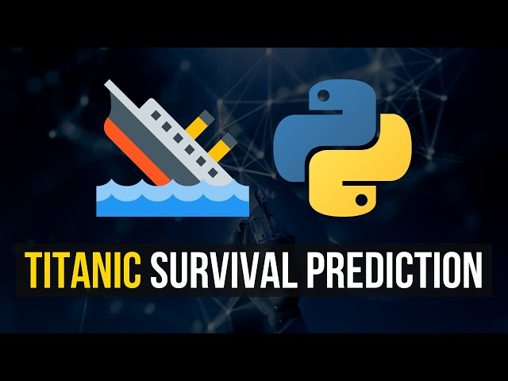

# The Titanic Project — Coming Soon

> 🚧 **This track is being written.** The dataset is famous, the code is in progress, and the parts will publish here as they're finished — same cadence as the Biometric series.

## What this track will cover

The Titanic dataset is the *"Hello, World!"* of machine learning — and like most Hello Worlds, it's taught badly. Most walkthroughs jump straight to a leaderboard score without ever explaining why each step is there. This track does it the other way around: every line of code earns its place.

The planned arc:

- **The dataset** — what the columns actually mean, what's missing, and why "Survived" being imbalanced matters.
- **Cleaning honestly** — handling NaNs, encoding categorical features, and the *small* preprocessing decisions that quietly drive most of your score.
- **Feature engineering** — extracting titles from names, family-size features, age bands, and seeing which ones genuinely help (and which are noise).
- **Your first classifier** — train, evaluate, and read a confusion matrix without pretending it's obvious.
- **Cross-validation and the leaderboard trap** — why a great validation score can still flop on Kaggle's hidden test set.

## Status

In drafting. Watch the Tutorials page — new parts publish here as soon as they're written and tested against the actual dataset.
