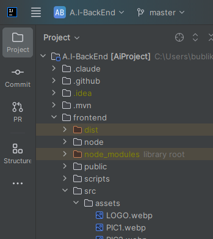
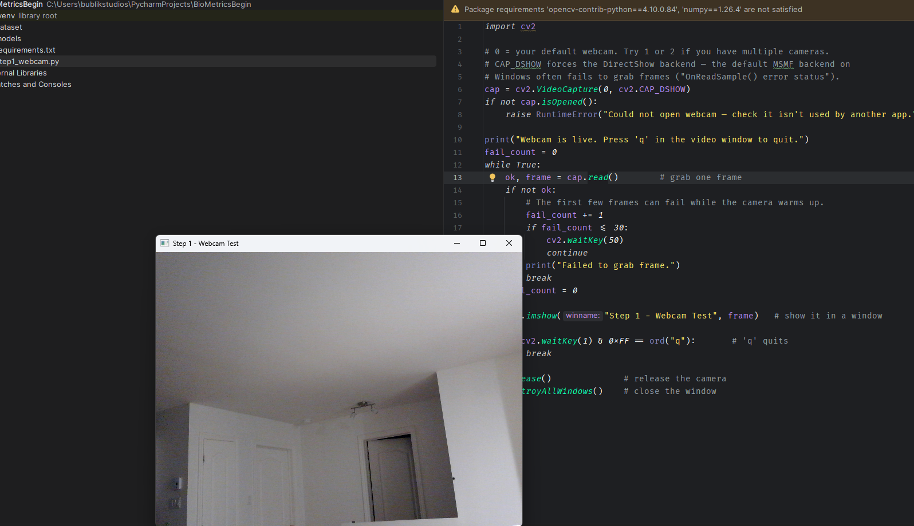

# Build a Face Recognition System in Python — Part 1: Setting Up Your Environment

Welcome to the series. By the end you'll have a working face recognition system — but every project starts with a solid foundation. In this part we'll install everything you need and confirm your webcam works. Don't skip this — every later part builds on it.

## What you need first (prerequisites)

- A computer with a webcam (built-in or USB)
- About 20 minutes
- No prior computer-vision experience — we explain as we go

## Step 1 — Install Python

We need Python 3.12 (or 3.11). Avoid 3.13 for now — some libraries we use don't have ready-made installers for it yet.

1. Go to [python.org/downloads](https://python.org/downloads) and download Python 3.12.
2. Run the installer. **Critical:** on the first screen, tick ✅ "Add Python to PATH" before clicking Install. This one checkbox prevents the most common beginner headache.
3. Verify it worked — open a terminal (on Windows: press Win, type `cmd`, Enter) and run:

```bash
python --version
```

You should see `Python 3.12.x`. If you get "command not found", reinstall and make sure the PATH box is ticked.

## Step 2 — Install a code editor

We recommend PyCharm Community Edition — it's free, and it handles a lot of setup for you. Download it from [jetbrains.com/pycharm](https://jetbrains.com/pycharm) (scroll to the free Community edition). VS Code also works if you prefer it.



## Step 3 — Create the project

1. Open PyCharm → New Project.
2. Name it `BioMetricsBegin`.
3. For the interpreter, choose "New virtual environment" (this is the default — leave it).
4. Click Create.

**What's a virtual environment, and why?**

A virtual environment (or "venv") is a private, isolated copy of Python that belongs to this one project. The libraries you install go inside it — not into your system-wide Python.

Why bother? Because different projects need different library versions. Without isolation, installing something for Project B can silently break Project A. A venv keeps each project's dependencies in their own sealed box. PyCharm created one for you automatically — it's the hidden `.venv` folder in your project.

Not using PyCharm? Create the venv manually from a terminal in your project folder:

- **Windows:** `python -m venv .venv` then `.venv\Scripts\activate`
- **macOS/Linux:** `python3 -m venv .venv` then `source .venv/bin/activate`

When the venv is active, your terminal prompt shows `(.venv)` at the start.

## Step 4 — Set up the project structure

Inside your project, create these folders and files (right-click the project → New):

```text
BioMetricsBegin/
├── dataset/            ← face images go here (Part 3)
├── models/             ← trained models go here (Part 4)
├── requirements.txt    ← the list of libraries we need
└── step1_webcam.py     ← our first script
```

## Step 5 — Install the libraries

Open `requirements.txt` and paste:

```text
opencv-contrib-python==4.10.0.84
numpy==1.26.4
```

What these are:

- **OpenCV** — the computer-vision engine that does the heavy lifting (reading the camera, finding faces, drawing on images). We use the contrib build because it includes an extra face module we need later.
- **NumPy** — the math library OpenCV is built on; images are really just grids of numbers.

⚠️ Install `opencv-contrib-python` — **not** plain `opencv-python`. Never install both; they conflict and cause confusing errors.

Now install them. In PyCharm, open the Terminal tab at the bottom (the venv activates automatically) and run:

```bash
pip install -r requirements.txt
```

Wait for it to finish — you'll see "Successfully installed ...".

## Step 6 — Test your webcam

This is the moment of truth. Paste this into `step1_webcam.py`:

```python
import cv2

# 0 = your default webcam. Try 1 or 2 if you have multiple cameras.
cap = cv2.VideoCapture(0)
if not cap.isOpened():
    raise RuntimeError("Could not open webcam — check it isn't used by another app.")

print("Webcam is live. Press 'q' in the video window to quit.")
while True:
    ok, frame = cap.read()        # grab one frame
    if not ok:
        print("Failed to grab frame.")
        break

    cv2.imshow("Step 1 - Webcam Test", frame)   # show it in a window

    if cv2.waitKey(1) & 0xFF == ord("q"):       # 'q' quits
        break

cap.release()              # release the camera
cv2.destroyAllWindows()    # close the window
```



How it works, line by line: `VideoCapture(0)` opens your camera. The `while` loop runs forever, grabbing one frame (a single photo) at a time and displaying it — many frames per second is what makes it look like live video. `waitKey(1)` waits 1 millisecond for a keypress so the window stays responsive, and quits when you press `q`. At the end we release the camera so other apps can use it.

Run the file (right-click → Run). A window should pop up showing live video of you. Press `q` to close it. If you see yourself — congratulations, your environment is ready. 🎉

## Troubleshooting

| Problem | Fix |
| --- | --- |
| `python` not recognized | Reinstall Python with "Add to PATH" ticked. |
| `No module named cv2` | The install didn't run in the venv. Confirm the terminal shows `(.venv)`, then re-run `pip install -r requirements.txt`. |
| Video window is black / freezes | Another app (Zoom, Teams, browser) is using the camera. Close it and retry. |
| Could not open webcam | Change `VideoCapture(0)` to `VideoCapture(1)`. On Windows you may also need `cv2.VideoCapture(0, cv2.CAP_DSHOW)`. |
| Camera permission denied | Windows Settings → Privacy & security → Camera → allow desktop apps. |
