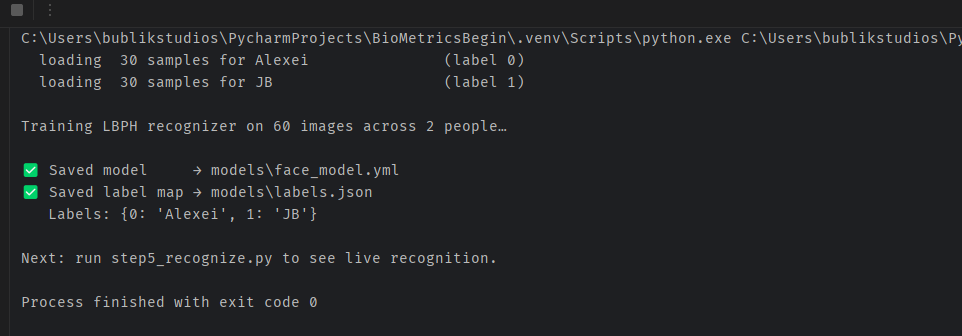

# Part 4 — Training the Recognizer

You've enrolled two (or more) people. Now we **train** — turning that pile of cropped face images into a single model file that, given a new face, can say *"that's Alexei"* or *"that's JB"*.

## What is "training", really?

In plain English: training is the step where the program looks at all your examples and builds a compact summary of what each person's face looks like — so it doesn't have to compare against thousands of raw images at recognition time.

For our recognizer that summary is called a **model**. It's a single file on disk. To recognize someone later, we just hand the model a fresh face and ask *"who is this?"*

## Meet LBPH — your first face recognizer

We'll use OpenCV's **LBPH recognizer** — *Local Binary Patterns Histograms*. It's the classic, no-frills face recognizer that's perfect for learning because:

- It trains in seconds on a normal laptop, no GPU.
- It uses no deep learning — you can actually *understand* what it does.
- It ships built into the `opencv-contrib-python` package we already installed.

Here's the intuition. LBPH walks across every pixel of a face image. For each pixel, it compares the pixel to its 8 neighbors — brighter or darker? — and encodes the result as an 8-bit binary number. Do this for every pixel and you get a new "pattern" image. Slice that pattern image into a grid, count up which patterns appear in each grid cell, and you get a **histogram** — basically a numerical fingerprint of the face.

To recognize a new face: compute its histogram, then find the saved person whose histogram is closest. That distance is the **confidence score** — lower means a better match.

It's not state-of-the-art (we'll upgrade to deep embeddings in an advanced part), but for two-to-ten enrolled people in consistent lighting, it works surprisingly well.

## A look at the training data

Before we train, here's what one of your saved samples actually looks like — a tight 200×200 grayscale crop, exactly the format LBPH expects:


Multiply that by 30 per person, across however many people you enrolled, and that's your full training set.

## The code

Create `step4_train.py`:

```python
import cv2
import numpy as np
import os
import glob
import json

# ── Configuration ────────────────────────────────────────────────
DATASET_DIR = "dataset"
MODELS_DIR = "models"
MODEL_FILE = os.path.join(MODELS_DIR, "face_model.yml")
LABELS_FILE = os.path.join(MODELS_DIR, "labels.json")
FACE_SIZE = (200, 200)               # must match Part 3's FACE_SIZE
MIN_SAMPLES_PER_PERSON = 5

os.makedirs(MODELS_DIR, exist_ok=True)

# ── Walk the dataset folder ──────────────────────────────────────
# Each subfolder of dataset/ is one person. The folder name is the label.
people = sorted(d for d in os.listdir(DATASET_DIR)
                if os.path.isdir(os.path.join(DATASET_DIR, d)))
if not people:
    raise SystemExit(
        f"No person folders inside {DATASET_DIR}/.\n"
        f"Run step3_enroll.py first to enroll at least one person."
    )

# LBPH needs INTEGER labels, not strings. We map "alex" → 0, "jane" → 1, etc.
images = []
label_ids = []
label_to_name = {}

for label_id, person in enumerate(people):
    label_to_name[label_id] = person
    person_dir = os.path.join(DATASET_DIR, person)
    sample_files = sorted(glob.glob(os.path.join(person_dir, "*.png")))

    if not sample_files:
        print(f"  ⚠️  Skipping {person} — no .png samples found.")
        continue
    if len(sample_files) < MIN_SAMPLES_PER_PERSON:
        print(f"  ⚠️  {person} only has {len(sample_files)} samples — "
              f"recognition for them will be unreliable.")

    print(f"  loading {len(sample_files):>3} samples for {person:<20} (label {label_id})")
    for f in sample_files:
        img = cv2.imread(f, cv2.IMREAD_GRAYSCALE)
        if img is None:
            print(f"  ⚠️  Could not read {f}, skipping.")
            continue
        img = cv2.resize(img, FACE_SIZE)
        images.append(img)
        label_ids.append(label_id)

if len(images) < 2:
    raise SystemExit("Need at least 2 face images to train. Run step3_enroll.py more.")
if len(set(label_ids)) < 2:
    print("\n⚠️  Only ONE person in the dataset. The model will recognize them, but "
          "there's no one else to mistake them for — enroll a second person for a "
          "more interesting test.\n")

# ── Train the LBPH recognizer ────────────────────────────────────
print(f"\nTraining LBPH recognizer on {len(images)} images across "
      f"{len(set(label_ids))} people…")

recognizer = cv2.face.LBPHFaceRecognizer_create()
recognizer.train(images, np.array(label_ids))

# ── Persist the model and the label map ──────────────────────────
recognizer.write(MODEL_FILE)
with open(LABELS_FILE, "w") as f:
    json.dump(label_to_name, f, indent=2)

print(f"\n✅ Saved model     → {MODEL_FILE}")
print(f"✅ Saved label map → {LABELS_FILE}")
print(f"   Labels: {label_to_name}")
print("\nNext: run step5_recognize.py to see live recognition.")
```

## The important lines, explained

### Listing the people

```python
people = sorted(d for d in os.listdir(DATASET_DIR) if os.path.isdir(...))
```

Lists every subfolder of `dataset/`. The folder name (e.g. `Alexei`) is the person's label. **Sorting** makes label IDs deterministic — re-running training assigns the same ID to the same person every time, which matters once we save the model.

### Strings to integers

```python
for label_id, person in enumerate(people):
```

LBPH only understands **integer** labels, not strings. We `enumerate` to assign each person an integer (`alex → 0`, `jane → 1`, …) and save the reverse map (`label_to_name`) so Part 5 can show the actual name on screen.

### Loading images

```python
img = cv2.imread(f, cv2.IMREAD_GRAYSCALE)
```

Loads each PNG as a single-channel grayscale image. We're explicit about grayscale so the loader always returns the same shape, no matter how the file was saved.

```python
img = cv2.resize(img, FACE_SIZE)
```

Defensive re-normalization. The enrollment script already resizes to 200×200, but if someone manually drops an oddly-sized image into a person folder later, this prevents training from crashing.

### Creating and training the recognizer

```python
recognizer = cv2.face.LBPHFaceRecognizer_create()
```

Instantiates the LBPH recognizer. Note `cv2.face` — that module only exists because we installed `opencv-contrib-python` in Part 1 instead of plain `opencv-python`. If this line errors with *"module 'cv2' has no attribute 'face'"*, you have the wrong OpenCV package.

```python
recognizer.train(images, np.array(label_ids))
```

This is the actual training. LBPH computes histograms for every image and stores them grouped by label. Training 60 faces takes well under a second.

### Saving the artifacts

```python
recognizer.write(MODEL_FILE)
```

Saves the model as a YAML file. From now on, anything that needs to recognize faces can just **load** this file in milliseconds — no need to re-train.

```python
json.dump(label_to_name, f, ...)
```

The recognizer only knows IDs (`0`, `1`, …), not names. We save the `id → name` map separately so Part 5 can turn a prediction like `0` into the string `"Alexei"`.

## Run it

Right-click `step4_train.py` → Run. You should see something like:

```text
  loading  30 samples for Alexei               (label 0)
  loading  30 samples for JB                   (label 1)

Training LBPH recognizer on 60 images across 2 people…

✅ Saved model     → models/face_model.yml
✅ Saved label map → models/labels.json
   Labels: {0: 'Alexei', 1: 'JB'}
```



Check the `models/` folder. Two new files:

- **`face_model.yml`** — the trained model. Open it in a text editor if you're curious — it's just YAML containing the histograms and the training parameters.
- **`labels.json`** — the id → name map: `{"0": "Alexei", "1": "JB"}`.

That's a trained face recognizer sitting on your disk. Tiny, self-contained, ready to load in any other Python script.

## Troubleshooting

| Problem | Fix |
| --- | --- |
| `module 'cv2' has no attribute 'face'` | You have `opencv-python` instead of `opencv-contrib-python`. Run `pip uninstall opencv-python opencv-contrib-python -y` then `pip install opencv-contrib-python==4.10.0.84`. |
| `No person folders inside dataset/` | Run `step3_enroll.py` first to enroll at least one person. |
| `Need at least 2 face images to train` | Same — enrollment hasn't produced enough samples yet. |
| Training finishes but recognition is wildly off | Re-enroll under the same lighting you'll use at recognition time. LBPH is very sensitive to lighting changes. |

## What's next

You have a trained model. In **Part 5** we'll load it, point a fresh webcam frame at it, and watch it call out names in real time — turning this whole series into an actual face-unlock proof of concept.
