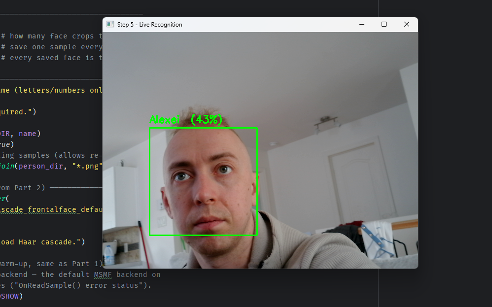
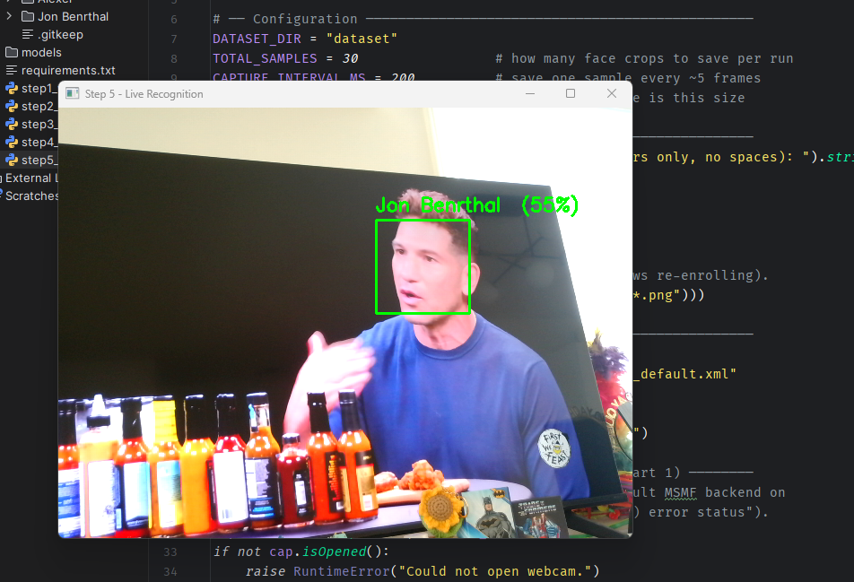

# Part 5 — Live Recognition

This is the part everything has been building toward. We have a trained model (Part 4). Now we'll open the webcam, find faces (Part 2), and ask the model *"who is this?"* — printing the name on screen, live, in real time. We'll also add an **Unknown** check so the system correctly rejects faces it has never seen.


## How recognition works

In Part 4 we trained a model and saved it to `models/face_model.yml`. Recognition is the reverse of training:

1. Grab a face from the camera.
2. Crop and resize it **exactly** the way we did during enrollment — 200×200 grayscale.
3. Hand it to the model's `predict()` method.
4. `predict()` returns two things: a **label ID** (which person it thinks it is) and a **distance** (how confident it is).

## The confidence score is backwards — read this carefully

This trips up everyone. OpenCV calls the second value *"confidence"*, but for LBPH it is actually a **distance**:

> Lower distance = better match. Higher distance = worse match.

A distance of `0` would be a perfect match. A distance of `45` is a strong match. A distance of `120` means *"this barely resembles anyone I know."* So "confidence" here behaves like golf — low score wins.

## The Unknown threshold

This is what makes the system trustworthy. The model **always** returns its best guess — even for a total stranger, it'll pick whichever enrolled person is "least different." Left unchecked, a burglar's face would get labelled *"Alexei."*

The fix: pick a **threshold**. If the best match's distance is above it, we ignore the guess and label the face `Unknown`:

```text
if distance <= THRESHOLD  →  trust it, show the name
if distance >  THRESHOLD  →  reject it, show "Unknown"
```

This is exactly how a real face-login decides whether to let someone in. We'll reuse this logic directly when we wire up the MySQL login in **Part 6**.

## The code

Create `step5_recognize.py`:

```python
import cv2
import json
import os

# ── Configuration ────────────────────────────────────────────────
MODELS_DIR = "models"
MODEL_FILE = os.path.join(MODELS_DIR, "face_model.yml")
LABELS_FILE = os.path.join(MODELS_DIR, "labels.json")
FACE_SIZE = (200, 200)               # must match Parts 3 & 4
# LBPH "confidence" is a DISTANCE — lower = better match.
# Above this value we treat the face as Unknown. Tune it for your setup.
CONFIDENCE_THRESHOLD = 80.0

# ── Load the trained model + label map ───────────────────────────
if not os.path.exists(MODEL_FILE):
    raise SystemExit(f"{MODEL_FILE} not found. Run step4_train.py first.")

recognizer = cv2.face.LBPHFaceRecognizer_create()
recognizer.read(MODEL_FILE)

with open(LABELS_FILE) as f:
    # JSON object keys are strings — convert them back to integer IDs.
    label_to_name = {int(k): v for k, v in json.load(f).items()}

print(f"Loaded model. Known people: {list(label_to_name.values())}")

# ── Load the detector (same one from Part 2) ─────────────────────
face_cascade = cv2.CascadeClassifier(
    cv2.data.haarcascades + "haarcascade_frontalface_default.xml"
)
if face_cascade.empty():
    raise RuntimeError("Failed to load Haar cascade.")

# ── Open the webcam (CAP_DSHOW + warm-up, same as Part 1) ────────
cap = cv2.VideoCapture(0, cv2.CAP_DSHOW)
if not cap.isOpened():
    raise RuntimeError("Could not open webcam.")

print("Live recognition running. Press 'q' to quit.")
fail_count = 0

while True:
    ok, frame = cap.read()
    if not ok:
        fail_count += 1
        if fail_count <= 30:
            cv2.waitKey(50)
            continue
        print("Failed to grab frame.")
        break
    fail_count = 0

    gray = cv2.cvtColor(frame, cv2.COLOR_BGR2GRAY)
    faces = face_cascade.detectMultiScale(gray, 1.1, 5, minSize=(80, 80))

    for (x, y, w, h) in faces:
        # Crop + resize EXACTLY like training, so the model sees consistent input.
        face_crop = cv2.resize(gray[y:y + h, x:x + w], FACE_SIZE)

        # predict() returns (label_id, distance). Lower distance = better match.
        label_id, distance = recognizer.predict(face_crop)

        if distance <= CONFIDENCE_THRESHOLD:
            name = label_to_name.get(label_id, "?")
            color = (0, 255, 0)            # green = recognized
        else:
            name = "Unknown"
            color = (0, 0, 255)            # red = stranger

        # Friendlier 0-100 score for display only (not a real probability).
        match_pct = max(0, 100 - distance)

        cv2.rectangle(frame, (x, y), (x + w, y + h), color, 2)
        cv2.putText(frame, f"{name}  ({match_pct:.0f}%)", (x, y - 10),
                    cv2.FONT_HERSHEY_SIMPLEX, 0.7, color, 2)

    cv2.imshow("Step 5 - Live Recognition", frame)
    if cv2.waitKey(1) & 0xFF == ord("q"):
        break

cap.release()
cv2.destroyAllWindows()
```

## The important lines, explained

### Loading the trained model

```python
recognizer = cv2.face.LBPHFaceRecognizer_create()
recognizer.read(MODEL_FILE)
```

We create an empty recognizer, then `read()` loads the trained histograms from `face_model.yml`. We never re-train here — training happened once in Part 4; recognition just loads the result. That's the whole point of saving a model to disk.

### Restoring integer keys from JSON

```python
label_to_name = {int(k): v for k, v in json.load(f).items()}
```

A subtle but important line. JSON has no integer keys — when we saved `{0: "Alexei"}` in Part 4, it became `{"0": "Alexei"}` on disk. The model returns integer IDs, so we convert the string keys back to ints, otherwise the lookup silently fails and everyone shows as `?`.

### Matching enrollment's preprocessing

```python
face_crop = cv2.resize(gray[y:y + h, x:x + w], FACE_SIZE)
```

Recognition input **must** match training input. We enrolled 200×200 grayscale crops, so we recognize 200×200 grayscale crops. Feed the model a color image or a different size and predictions become garbage. Consistency between training and inference is the golden rule of every ML system.

### The actual prediction

```python
label_id, distance = recognizer.predict(face_crop)
```

The recognition itself. The model compares this face's histogram against every enrolled person and returns the closest `label_id` plus the `distance` to it.

### The Unknown gate

```python
if distance <= CONFIDENCE_THRESHOLD:
```

Below the threshold we trust the name; above it we reject as `Unknown`. This single line is the difference between a toy and a security system.

### Display convenience

```python
match_pct = max(0, 100 - distance)
```

Distance isn't a percentage, but `100 - distance` gives an intuitive "higher is better" number for the on-screen label. Don't mistake it for a true probability — it's just friendlier than showing a raw distance.

## Run it

1. Make sure you've already run `step4_train.py` (you need `models/face_model.yml`).
2. Right-click `step5_recognize.py` → **Run**.
3. Look at the camera — a green box with your name should appear. Have your second enrolled person step in — the label switches to their name.
4. Hold up a photo of a stranger, or have an un-enrolled person appear — the box turns red and reads `Unknown`.

Here's what it actually looks like in practice — each enrolled person gets a green box with their name and a live match percentage:





That's a working face recognition system.

## Tuning the threshold

`CONFIDENCE_THRESHOLD = 80.0` is a starting point — the right value depends on your camera and lighting. Watch the `%` numbers as you test:

| Symptom | Cause | Fix |
| --- | --- | --- |
| Strangers get labelled with a real name | Threshold too high (too lenient) | Lower it (try 65–70) |
| You get labelled `Unknown` sometimes | Threshold too low (too strict) | Raise it (try 90–100) |
| Names flicker between people | Faces too similar / too few samples | Enroll more samples per person |

Watch your own face's `%` for a few seconds, then a stranger's, and set the threshold to sit cleanly between the two.

## Troubleshooting

| Problem | Fix |
| --- | --- |
| `face_model.yml not found` | Run `step4_train.py` first. |
| Everyone shows as `?` | The label map didn't load — confirm `labels.json` exists and the `int(k)` conversion is in place. |
| `module 'cv2' has no attribute 'face'` | You have plain `opencv-python`; reinstall `opencv-contrib-python`. |
| Recognition is very flickery | Lighting differs from enrollment. Re-enroll under the same lighting you'll use at recognition time. |

## What's next

You now have live face recognition with stranger rejection. In **Part 6**, we connect it to the real world: a face login backed by your MySQL database — capture a face on registration, recognize it on login, and grant access only when the match is confident enough.
