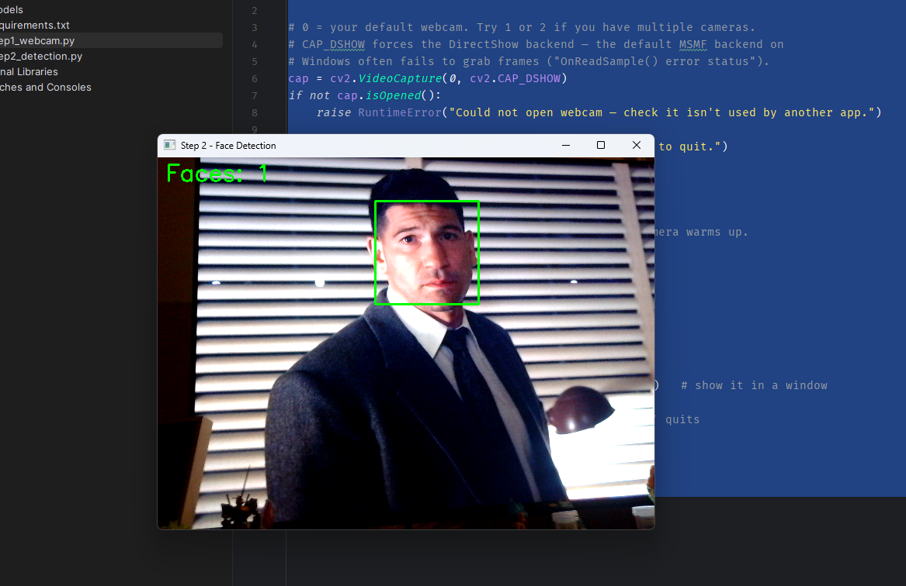

# Part 2 — Detecting Faces with Haar Cascades

In Part 1 you got your webcam streaming live video. Now we make it *see* — drawing a green box around every face in the frame, in real time. We'll use OpenCV's built-in Haar cascade classifier: a small, fast, pre-trained face detector that ships with OpenCV, so there's nothing extra to download.

## What is a Haar cascade?

A Haar cascade is a chain of very simple shape-pattern tests, trained on thousands of face/non-face images. Each stage asks a quick yes/no question (*does this patch look face-like in this specific way?*) and rejects anything that fails. Most of the image gets thrown out after the first one or two stages, which is why this method runs comfortably at webcam speed — even on a laptop without a GPU.

It's not as accurate as modern deep-learning detectors, but for getting a working face recognition system off the ground, it's perfect.

## Step 1 — Create the script

In your `BioMetricsBegin` project from Part 1, create a new file next to `step1_webcam.py`:

```text
BioMetricsBegin/
├── step1_webcam.py
└── step2_detect.py    ← new
```

Paste this in:

```python
import cv2

# Load OpenCV's built-in Haar cascade for frontal faces.
# cv2.data.haarcascades is the folder of pre-trained models that ship
# with OpenCV — so there is nothing to download.
face_cascade = cv2.CascadeClassifier(
    cv2.data.haarcascades + "haarcascade_frontalface_default.xml"
)
if face_cascade.empty():
    raise RuntimeError("Failed to load the Haar cascade model.")

# CAP_DSHOW forces the DirectShow backend — the default MSMF backend on
# Windows often fails to grab frames ("OnReadSample() error status").
cap = cv2.VideoCapture(0, cv2.CAP_DSHOW)
if not cap.isOpened():
    raise RuntimeError("Could not open webcam — check it isn't used by another app.")

print("Detecting faces. Press 'q' to quit.")
fail_count = 0
while True:
    ok, frame = cap.read()
    if not ok:
        # The first few frames can fail while the camera warms up.
        fail_count += 1
        if fail_count <= 30:
            cv2.waitKey(50)
            continue
        print("Failed to grab frame.")
        break
    fail_count = 0

    # Haar cascades work on a single-channel (grayscale) image.
    gray = cv2.cvtColor(frame, cv2.COLOR_BGR2GRAY)

    # The core line: scan the image, return one box per detected face.
    faces = face_cascade.detectMultiScale(
        gray,
        scaleFactor=1.1,    # shrink image 10% each pass to catch different face sizes
        minNeighbors=5,     # overlapping hits needed to trust a detection (higher = stricter)
        minSize=(80, 80),   # ignore anything smaller than 80x80 pixels
    )

    # Draw a green rectangle around every detected face.
    for (x, y, w, h) in faces:
        cv2.rectangle(frame, (x, y), (x + w, y + h), (0, 255, 0), 2)

    # Show the live face count in the top-left corner.
    cv2.putText(frame, f"Faces: {len(faces)}", (10, 30),
                cv2.FONT_HERSHEY_SIMPLEX, 1, (0, 255, 0), 2)

    cv2.imshow("Step 2 - Face Detection", frame)
    if cv2.waitKey(1) & 0xFF == ord("q"):
        break

cap.release()
cv2.destroyAllWindows()
```

Run it (right-click → Run). A window opens, and a green box should track your face as you move. Press `q` to quit.



## The important lines, explained

### Loading the detector

```python
face_cascade = cv2.CascadeClassifier(cv2.data.haarcascades + "...")
```

Loads the pre-trained detector from an XML file. `cv2.data.haarcascades` is the path to OpenCV's bundled models — `haarcascade_frontalface_default.xml` is the face one. We immediately check `.empty()` because a wrong path fails silently otherwise.

### Going grayscale

```python
gray = cv2.cvtColor(frame, cv2.COLOR_BGR2GRAY)
```

Converts the color frame to grayscale. The detector only cares about brightness patterns, not color — and one channel instead of three means roughly 3× less data to crunch. (Note: OpenCV stores color as **BGR**, not RGB — a famous OpenCV gotcha.)

### Running the detection

```python
faces = face_cascade.detectMultiScale(gray, ...)
```

This is the heart of the program. It slides a search window across the image at many sizes and returns a list of boxes — one `(x, y, w, h)` per face: top-left corner plus width and height. The three parameters are the ones you'll tune:

| Parameter | What it does | If you raise it |
| --- | --- | --- |
| `scaleFactor=1.1` | How much the image shrinks each pass, so faces near and far are both found | Faster, but misses faces |
| `minNeighbors=5` | How many overlapping detections are needed before a face is "confirmed" | Fewer false positives, but may miss real faces |
| `minSize=(80,80)` | Smallest face to bother detecting | Ignores small/distant faces |

These are your accuracy knobs. Too many false boxes? Raise `minNeighbors`. Missing your face? Lower `scaleFactor` toward `1.05`.

### Drawing the boxes

```python
for (x, y, w, h) in faces:
    cv2.rectangle(frame, (x, y), (x + w, y + h), (0, 255, 0), 2)
```

Each detected face is just four numbers. We unpack them and draw a rectangle on the original *color* frame (not the grayscale one we used for detection). `cv2.rectangle` takes the top-left corner `(x, y)`, the bottom-right corner `(x + w, y + h)`, a color `(0, 255, 0)` (green in BGR), and a thickness of `2` pixels.

### Live face count

```python
cv2.putText(...)
```

Stamps the face count onto the frame so you get live feedback while you tune the parameters.

## Try it out

Now have some fun:

- Walk **toward and away from the camera** — at what distance does the box disappear? That's `minSize` kicking in.
- **Tilt your head sideways**. Haar cascades for frontal faces don't tolerate much rotation — this is one of their real limits, and a reason modern detectors win.
- Hold up a **printed photo of a face**. It will detect that too — Haar cascades don't know real from fake. (Spoof detection is a whole separate problem.)
- Drop `minNeighbors` to `2` and watch the **false positives** appear on textured surfaces.

## Troubleshooting

| Problem | Fix |
| --- | --- |
| `Failed to load the Haar cascade model` | You installed `opencv-python` instead of `opencv-contrib-python`. Reinstall per Part 1. |
| Boxes flicker on and off | Lower `minNeighbors` to `3`, or improve the lighting on your face. |
| Boxes appear on things that aren't faces | Raise `minNeighbors` to `7` or `8`. |
| Window freezes / FPS drops | Raise `minSize` (e.g. `(120, 120)`) — fewer scales to scan. |
| `OnReadSample() error status` on Windows | Already handled by `cv2.CAP_DSHOW` — make sure that flag is on the `VideoCapture` line. |

In **Part 3** we'll capture face images of *you* and save them into the `dataset/` folder — the training data we'll use to teach the system to recognize who's in front of the camera.
