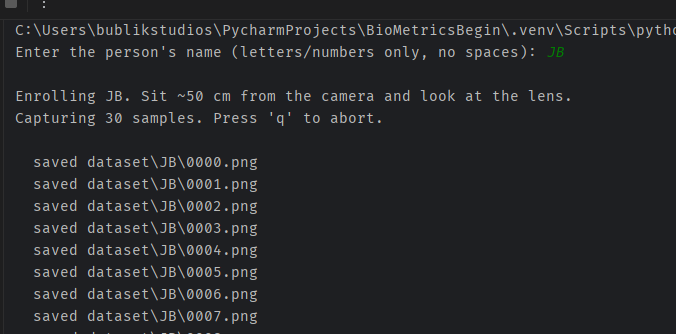

# Part 3 — Building Your Face Database

We can find faces. Now we need to **collect** them — building a labeled dataset that the recognizer will learn from in Part 4. In this part you'll write an enrollment script: the program asks *"who are you?"*, you sit in front of the camera, and it quietly snaps 30 cropped photos of your face and files them by name.

## Why a dataset at all?

Face recognition isn't magic — it's a model that has been shown examples. Without examples, no model can learn. The enrollment step in any face-unlock system (Face ID, Windows Hello, your office badge reader) is doing exactly what we're about to build: capturing a personal dataset that's later used to identify you.

For this beginner version we keep it simple: **front-facing samples only**. That's enough to reliably recognize someone as long as they roughly face the camera at login time — which is how nearly every face login already works.

## Dataset structure

After enrolling two people the folder will look like this:

```text
dataset/
├── alex/
│   ├── 0000.png
│   ├── 0001.png
│   └── ... 30 frontal face crops
└── jane/
    ├── 0000.png
    └── ...
```

The folder name **is** the label — in Part 4, the training loop reads each folder name to know whose face it's looking at. Keep names simple and consistent: no spaces, no special characters.

## The code

Create `step3_enroll.py` next to your previous scripts:

```python
import cv2
import os
import glob
import time

# ── Configuration ────────────────────────────────────────────────
DATASET_DIR = "dataset"
TOTAL_SAMPLES = 30                 # how many face crops to save per run
CAPTURE_INTERVAL_MS = 200          # save one sample every ~5 frames
FACE_SIZE = (200, 200)             # every saved face is this size

# ── Ask who we're enrolling ──────────────────────────────────────
name = input("Enter the person's name (letters/numbers only, no spaces): ").strip()
if not name:
    raise SystemExit("A name is required.")

person_dir = os.path.join(DATASET_DIR, name)
os.makedirs(person_dir, exist_ok=True)
# Continue numbering from any existing samples (allows re-enrolling).
start_idx = len(glob.glob(os.path.join(person_dir, "*.png")))

# ── Load the detector (same one from Part 2) ─────────────────────
face_cascade = cv2.CascadeClassifier(
    cv2.data.haarcascades + "haarcascade_frontalface_default.xml"
)
if face_cascade.empty():
    raise RuntimeError("Failed to load Haar cascade.")

# ── Open the webcam (CAP_DSHOW + warm-up, same as Part 1) ────────
cap = cv2.VideoCapture(0, cv2.CAP_DSHOW)
if not cap.isOpened():
    raise RuntimeError("Could not open webcam.")

print(f"\nEnrolling {name}. Sit ~50 cm from the camera and look at the lens.")
print(f"Capturing {TOTAL_SAMPLES} samples. Press 'q' to abort.\n")

captured = 0
idx = start_idx
last_capture_ms = 0
fail_count = 0

while captured < TOTAL_SAMPLES:
    ok, frame = cap.read()
    if not ok:
        fail_count += 1
        if fail_count <= 30:
            cv2.waitKey(50)
            continue
        print("Failed to grab frame.")
        break
    fail_count = 0

    gray = cv2.cvtColor(frame, cv2.COLOR_BGR2GRAY)
    faces = face_cascade.detectMultiScale(gray, 1.1, 5, minSize=(80, 80))

    # If multiple faces are visible, pick the biggest one (closest to camera).
    face_box = max(faces, key=lambda f: f[2] * f[3]) if len(faces) > 0 else None
    if face_box is not None:
        x, y, w, h = face_box
        cv2.rectangle(frame, (x, y), (x + w, y + h), (0, 255, 0), 2)

    now_ms = int(time.time() * 1000)
    if face_box is not None and (now_ms - last_capture_ms) >= CAPTURE_INTERVAL_MS:
        x, y, w, h = face_box
        face_crop = gray[y:y + h, x:x + w]
        face_crop = cv2.resize(face_crop, FACE_SIZE)
        filename = os.path.join(person_dir, f"{idx:04d}.png")
        cv2.imwrite(filename, face_crop)
        print(f"  saved {filename}")
        idx += 1
        captured += 1
        last_capture_ms = now_ms

    cv2.putText(frame, f"Enrolling: {name}", (10, 30),
                cv2.FONT_HERSHEY_SIMPLEX, 0.9, (0, 255, 255), 2)
    cv2.putText(frame, f"Samples: {captured}/{TOTAL_SAMPLES}",
                (10, frame.shape[0] - 15),
                cv2.FONT_HERSHEY_SIMPLEX, 0.7, (0, 255, 0), 2)

    cv2.imshow("Step 3 - Front Face Enrollment", frame)
    if cv2.waitKey(1) & 0xFF == ord("q"):
        break

cap.release()
cv2.destroyAllWindows()
print(f"\nDone. {captured} new samples saved to {person_dir}")
```



## The important lines, explained

### Asking who we're enrolling

```python
name = input(...)
```

A console prompt for the person's name. Every enterprise enrollment flow starts with *"who are you saying you are?"* before the camera fires.

### Creating the person's folder

```python
os.makedirs(person_dir, exist_ok=True)
```

Creates `dataset/<name>/` if it doesn't exist. The `exist_ok=True` flag is the standard "don't crash if it already exists" pattern, letting the script be re-run safely.

```python
start_idx = len(glob.glob(...))
```

Counts existing files so re-running the script **adds** new samples instead of overwriting old ones. Forgetting this is a beginner mistake that silently destroys data.

### Picking one face per frame

```python
face_box = max(faces, key=lambda f: f[2] * f[3])
```

If someone walks behind you, the detector returns two boxes. We pick the largest one (width × height = area) — the face closest to the camera. Always handle the multi-face case explicitly, otherwise you may quietly save photos of the wrong person.

### Cropping the face

```python
face_crop = gray[y:y + h, x:x + w]
```

A NumPy slice. Important gotcha: an image is `[row, column]`, so it's `[y, x]` order — **not** `[x, y]`. We crop from the **grayscale** frame because that's exactly what Part 4's recognizer will expect.

```python
face_crop = cv2.resize(face_crop, FACE_SIZE)
```

Every saved face is exactly 200×200 pixels. The LBPH recognizer in Part 4 **requires** uniform input dimensions — this single line is what makes training possible later.

### Throttling the capture rate

```python
(now_ms - last_capture_ms) >= CAPTURE_INTERVAL_MS
```

Throttles to ~5 captures per second. Without it we'd save 30 near-identical frames per second — bloated and uselessly redundant.

## Run it

1. Right-click `step3_enroll.py` → Run.
2. Type a name in the console (e.g. `alex`) and press Enter.
3. Look at the camera. The green box tracks your face. The counter ticks `0/30 → 30/30` over about 6 seconds.
4. Open `dataset/alex/` — you should see 30 PNGs. Open a few and verify they're tight, square, grayscale crops of your face.

Then **enroll a second person**. Run again with a different name. Use a family member, a coworker, or even a clear photo on your phone screen held in front of the camera. Two people is the minimum that makes training meaningful — with one person the recognizer has no real choice to make.

## Troubleshooting

| Problem | Fix |
| --- | --- |
| Counter stays at `0/30` | The face cascade isn't detecting your face. Improve lighting and face the camera squarely. |
| Saved crops look squashed | Sit straight on. The crop preserves the cascade's box, so a tilted head produces a tilted crop. |
| Two people in frame mix together | Enroll alone — the largest-face rule helps, but a sibling leaning in still gets captured if they're closer. |
| `Could not open webcam` | Same fixes as Part 1 — another app has the camera, or try `VideoCapture(1, cv2.CAP_DSHOW)`. |

## What's next

You now have a **labeled** dataset of face images. In Part 4 we'll feed it to OpenCV's LBPH face recognizer, train a model, and save it to disk — turning a folder of pictures into something that can actually identify people.
